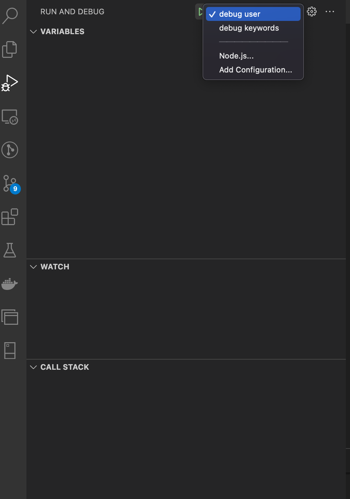
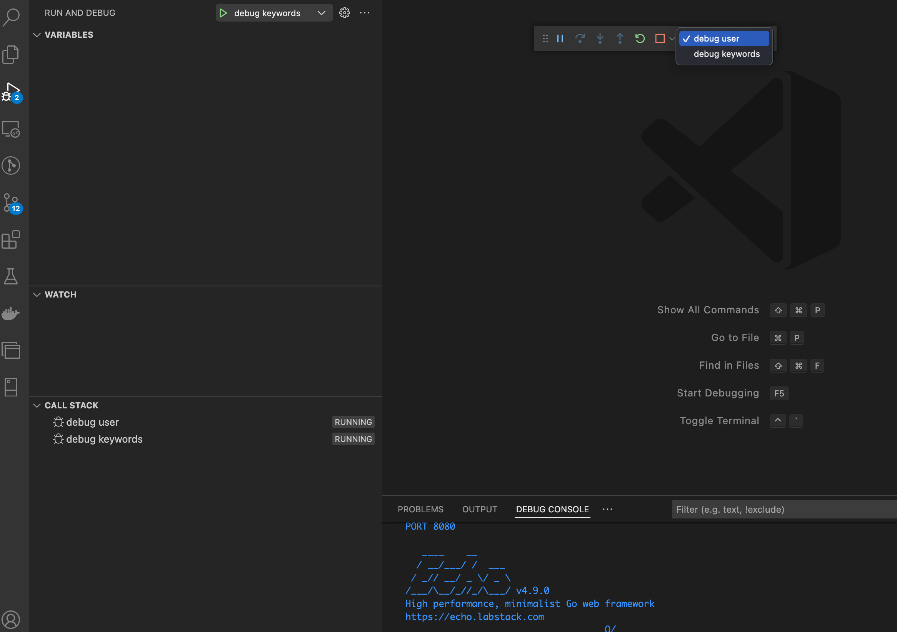

# To start server
using vscode debug tool

select user and keyword and run debug. \
sorry for the inconvenience way to start the server I havd a plan to deploy api to cloud provider using docker but I'm not quite good at it.\
as you can see in the project I have 2 services so it's easy to maintain when deploy to real server using docker.

# To start database using docker
docker run --name myPostgresDb -p 5455:5432 -e POSTGRES_USER=test -e POSTGRES_PASSWORD=1234 -e POSTGRES_DB=extract_google_search -d postgres \
this is postman for test api\
https://api.postman.com/collections/12398625-3d81c4d5-d38f-488e-9ddb-d1065dd5d517?access_key=PMAT-01GJMXZXZN9TQPN2EW1XN4VTY7
